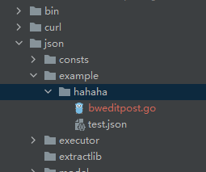
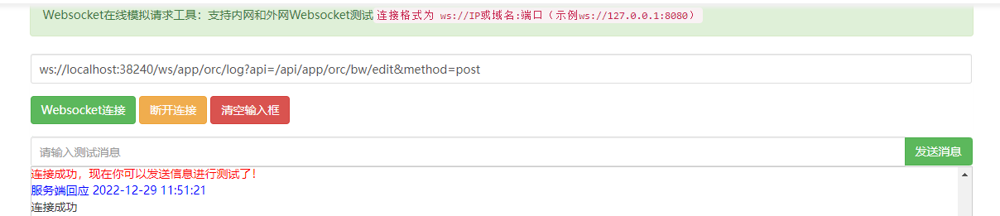
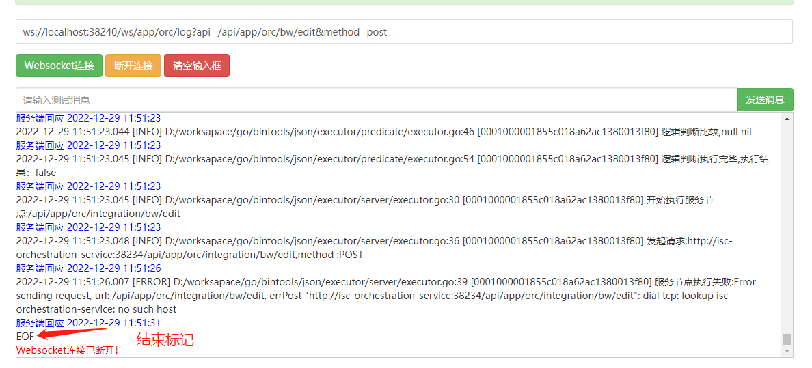

# json文件解释器
可动态、增量地编译json文件
其步骤如下：
1. 将json文件按照既定语法解释为Go语法，并写为Go文件
2. 将Go文件内容作为脚本，进行编译、解释与执行
3. 根据结果定义对结果进行组装
4. 支持增量编译json文件，支持直接运行javascript脚本和Go代码

# 2 介绍
## 2.1 包结构介绍
```text
├─consts 全局常量
├─example 生成的Go文件存储目录
│  └─hahaha 租户ID路径
├─executor 执行器，包括js执行器、入参解释器、条件执行器、响应组装执行器、服务节点执行器以及执行器的工具
│  ├─js 
│  ├─parameter
│  ├─predicate
│  ├─response
│  ├─server
│  └─util
├─extractlib 依赖包，将依赖包通过go:generate的方式固化，达到离线编译的目的
├─model 入参、出参以及API定义信息
├─scripts js脚本内容存储地址
├─service 服务入口
└─template 模板信息
```
## 2.2 执行入口
执行 `go run server.go ` 启动占用:`38240`端口
服务提供两个重要接口:
### 2.2.1 构建接口
将json文件解析成Go语言文件，并进行预加载
示例如下：
```text

curl --location --request POST 'http://localhost:38240/api/app/orc-server/build/file' \
--header 'isc-tenant-id;' \
--header 'User-Agent: apifox/1.0.0 (https://www.apifox.cn)' \
--form 'file=@"C:\\Users\\admin\\Desktop\\dsl\\test.json"'

{
    "code": 0,
    "message": "构建成功",
    "data": null
}
```
日志内容如下：
```text
{"level":"info","time":"2022-12-16T18:33:01+08:00","message":"将json内容解析成apixData对象"}
{"level":"info","time":"2022-12-16T18:33:01+08:00","message":"apixData对象解析成go源码"}
[GIN] 2022/12/16 - 18:33:01 | 200 |      26.204ms |             ::1 | POST     "/api/app/orc-server/build/file"
{"level":"info","time":"2022-12-16T18:33:01+08:00","message":"编译文件:D:\\worksapace\\go\\bintools\\json\\example\\hahaha\\bweditpost.go,key=bweditpost.go"}
{"level":"info","time":"2022-12-16T18:33:01+08:00","message":"文件编译完成"}
```

构建成功后，会在example目录下，生成对应的文件夹和文件



### 2.2.2 执行入口
示例如下：
```text
curl --location --request POST 'http://localhost:38240/api/app/orc/bw/edit?test_p=嘿嘿' \
--header 'isc-tenant-id: hahaha' \
--header 'token: 3cb5c40b-be7c-4ea3-9880-4e30f6e0fc70' \
--header 'User-Agent: apifox/1.0.0 (https://www.apifox.cn)' \
--header 'Content-Type: application/json' \
--data-raw '{
    "name": "你好，老库",
    "pwd": "aliquip",
    "a": "anim non dolor"
}'

{
    "code": 0,
    "message": "请求成功",
    "data": {
        "code": 0,
        "message": "你好，老库"
    }
}
```
执行日志如下：
```text
{"level":"info","time":"2022-12-16T18:35:16+08:00","message":"当前请求:/api/app/orc/bw/edit,Method:POST,执行文件:[bweditpost]"}
{"level":"info","time":"2022-12-16T18:35:16+08:00","message":"链路跟踪启动..."}
{"level":"info","time":"2022-12-16T18:35:16+08:00","message":"traceId = 0001000001851a80a4d6ac1380010b90"}
{"level":"info","time":"2022-12-16T18:35:16+08:00","message":"内容读取路径:key=$.personMobile"}
...
{"level":"info","time":"2022-12-16T18:35:16+08:00","message":"执行步骤节点:5774760d68f74722855e236a4a66647f"}
{"level":"info","time":"2022-12-16T18:35:16+08:00","message":"请求地址:http://10.30.30.95:38800/api/tddm/model/basic/1600380685216194561"}
...
{"level":"info","time":"2022-12-16T18:35:16+08:00","message":"执行步骤节点:c83199232f3e468ea737564d74326576"}
{"level":"info","time":"2022-12-16T18:35:16+08:00","message":"替换前的脚本内容:$21330edbcb3242c1aacddfb69860d3fc.....}
{"level":"info","time":"2022-12-16T18:35:16+08:00","message":"替换后的脚本内容:let a1671186916684.......}
...
{"level":"info","time":"2022-12-16T18:35:16+08:00","message":"流程步骤执行完毕，开始组装结果映射..."}
```
### 2.2.3 删除某次编译
```text
curl --location --request DELETE 'http://localhost:38240/api/app/orc-server/build/file?api=/api/app/orc/bw/edit&method=post&json=test.json' \
--header 'isc-tenant-id: hahaha' \
```

### 2.2.4 直接运行脚本内容
1. 运行JavaScript脚本
```text
curl --location --request POST 'http://localhost:38240/api/app/orc-server/runner' \
--header 'User-Agent: apifox/1.0.0 (https://www.apifox.cn)' \
--header 'Content-Type: application/json' \
--data-raw '{
    "script": "let a = 2 \n a",
    "language": "javascript"
}'
```
响应内容：
```text
{
    "code": 0,
    "message": "成功",
    "data": 2
}
```
2. 运行Go代码
```text
curl --location --request POST 'http://localhost:38240/api/app/orc-server/runner' \
--header 'User-Agent: apifox/1.0.0 (https://www.apifox.cn)' \
--header 'Content-Type: application/json' \
--data-raw '{
    "script": "func MyTest(args ...any) any {\n\t return \"你好老库\"}",
    "language": "go",
    "method":"MyTest"
}'
```
响应内容
```text
{
    "code": 0,
    "message": "成功",
    "data": "你好老库"
}
```
### 2.2.5 输出步骤日志
JSON 引擎支持每一步的执行日志信息,如果需要输出执行日志，请先发起websocket连接，并在5s内发起执行请求.
1. websocket连接成功后，提示：“连接成功”。<red> **api和method为必填项**</red>

2. 发起请求后，持续输出日志，直到EOF

